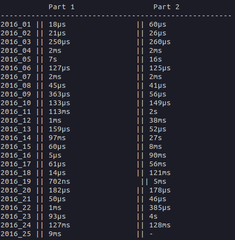
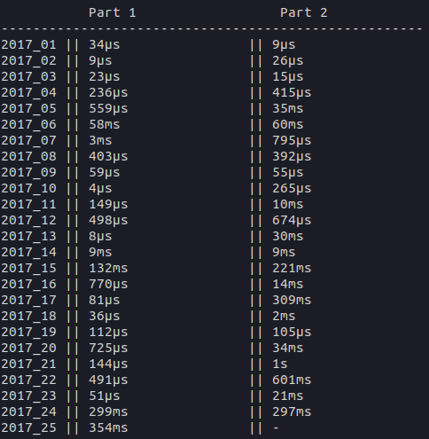

# Advent-of-code

My codes for the challenges of adventofcode.com

## Which year in which language ?

|           | 2015 | 2016 | 2017 | 2018       | 2019       | 2020       | 2021 | 2022       | 2023 |
|-----------|------|------|------|------------|------------|------------|------|------------|------|
| **day01** | Rust | Rust | Rust | JavaScript | JavaScript | JavaScript | Rust | Go         |      |
| **day02** | Rust | Rust | Rust | JavaScript | JavaScript | JavaScript | Rust | Go         |      |
| **day03** | Rust | Rust | Rust | JavaScript | JavaScript | JavaScript | Rust | Go         |      |
| **day04** | Rust | Rust | Rust | JavaScript | JavaScript | JavaScript | Rust | Go         |      |
| **day05** | Rust | Rust | Rust | JavaScript | JavaScript | JavaScript | Rust | Go         |      |
| **day06** | Rust | Rust | Rust | JavaScript | JavaScript | JavaScript | Rust | Go         |      |
| **day07** | Rust | Rust | Rust | TypeScript | JavaScript | JavaScript | Rust | Go         |      |
| **day08** | Rust | Rust | Rust | TypeScript | TypeScript | JavaScript | Rust | Go         |      |
| **day09** | Rust | Rust | Rust | TypeScript | TypeScript | JavaScript | Rust | TypeScript |      |
| **day10** | Rust | Rust | Rust | TypeScript | TypeScript | JavaScript | Rust | TypeScript |      |
| **day11** | Rust | Rust | Rust | TypeScript | TypeScript | JavaScript | Rust | TypeScript |      |
| **day12** | Rust | Rust | Rust | TypeScript | Rust       | TypeScript | Rust | TypeScript |      |
| **day13** | Rust | Rust | Rust | Rust       | Rust       | TypeScript | Rust | TypeScript |      |
| **day14** | Rust | Rust | Rust | Rust       | Rust       | TypeScript | Rust | TypeScript |      |
| **day15** | Rust | Rust | Rust | Rust       | Rust       | TypeScript | Rust | TypeScript |      |
| **day16** | Rust | Rust | Rust | Rust       | Rust       | TypeScript | Rust | TypeScript |      |
| **day17** | Rust | Rust | Rust | Rust       | Rust       | TypeScript | Rust | Rust       |      |
| **day18** | Rust | Rust | Rust | Rust       | Rust       | TypeScript | Rust | Rust       |      |
| **day19** | Rust | Rust | Rust | Rust       | Rust       | TypeScript | Rust | Rust       |      |
| **day20** | Rust | Rust | Rust | Rust       | Rust       | Go         | Rust | Rust       |      |
| **day21** | Rust | Rust | Rust | Rust       | Rust       | Go         | Rust | Rust       |      |
| **day22** | Rust | Rust | Rust | Rust       | Rust       | Rust       | Rust | Rust       |      |
| **day23** | Rust | Rust | Rust | Rust       | Rust       | Rust       | Rust | Rust       |      |
| **day24** | Rust | Rust | Rust | Rust       | Rust       | Rust       | Rust | Rust       |      |
| **day25** | Rust | Rust | Rust | Rust       | Rust       | Rust       | Rust | Rust       |      |

## Benchmarks

Benchmarks are for days written in Rust, compiled with the `--release` flag, and are real time. They include only one parsing of the input per day. \
Some days deserve to be much more optimized than they currently are.

### 2015

### 2016

### 2017

### 2018

### 2019

Day25 needs a fix to read output.

### 2020

### 2021

### 2022

## Challenges that have caused me some problems/ that I have failed to do alone

* 2021::24 : Reverse engineering

* 2015::15 : Mixed-integer non linear problem. So hard for a day 15 problem.

* 2015::24 : Interesting optimizations

* 2018::03 : 4th time on the squares overlapping problem. I must still miss an important optimization (20s to compute overlapping area...).

* 2020::17 : Not hard, BUT custom equality doesn't exist in js for sets : it is an equality of pointers. This is exhausting.

* 2020::19 : My code for part 2 is... not supposed to work ? (it should not avoid infinite loops...)

* 2018::14 : 300s for part 2, and I can't find a way to optimize it... [Apparently lazy linked lists seem to do the job](https://www.reddit.com/r/adventofcode/comments/a61ojp/comment/ebr5c0q/?utm_source=share&utm_medium=web2x&context=3), but I didn't spend enough time to implement it in rust.

* 2019::22 : Deck shuffling. This is mathematically hard and very interesting.

## 2022 Notes

Days that were hard to solve or required some interesting algorithms have a README :

* 11
* 15
* 16
* 19
* 20
* 21 !
* 22
* 24
* 25

(some other days have a README, but these are the most interesting to me)
